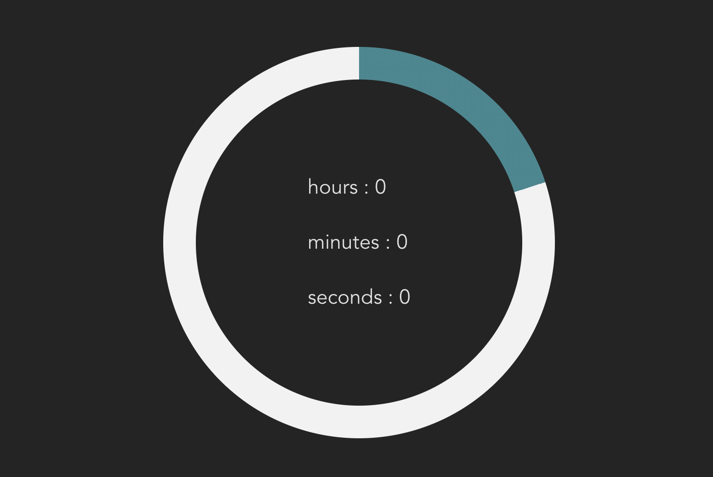

# doc

# How to run?

1. yarn or  npm i
2. yarn dev or npm run dev

# Pie code:



component

```jsx
<div
            style={{
                position: 'relative',
                display: 'flex',
                flex: 1,
                alignItems: 'center',
                justifyContent: 'center',
            }}
        >
            <div
                style={{
                    display: 'flex',
                    height: '50%',
                    position: 'absolute',
                    justifyContent: 'space-evenly',
                    flexDirection: 'column',
                    fontSize: 20,
                }}
            >
                <div>hours : {h}</div>
                <div>minutes : {m}</div>
                <div>seconds : {s}</div>
            </div>
            <div className={styles.pie} style={{ '--p': percentage as number }}></div>
        </div>
```

css

```jsx
--v: calc(((18 / 5) * var(--p) - 90) * 1deg);

    width: 20rem;
    height: 20rem;
    display: inline-block;
    border-radius: 50%;
    padding: 2rem;
    background: linear-gradient(#242424, #242424) content-box,
        linear-gradient(var(--v), #f2f2f2 50%, transparent 0) 0 / min(100%, (50 - var(--p)) * 100%),
        linear-gradient(var(--v), transparent 50%, #3a8891 0) 0 / min(100%, (var(--p) - 50) * 100%),
        linear-gradient(to right, #f2f2f2 50%, #3a8891 0);
```

using Pie

```jsx
const [state, setState] = useState({ ms: 0, s: 0, m: 0, h: 0 });
const [percentage, setPercentage] = useState(20);

export default ()=> <Pie h={state.h} m={state.m} s={state.s} percentage={percentage} />
```
